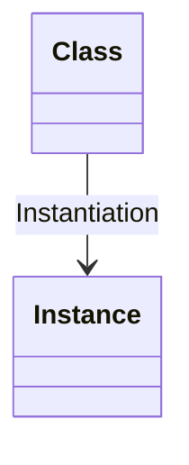
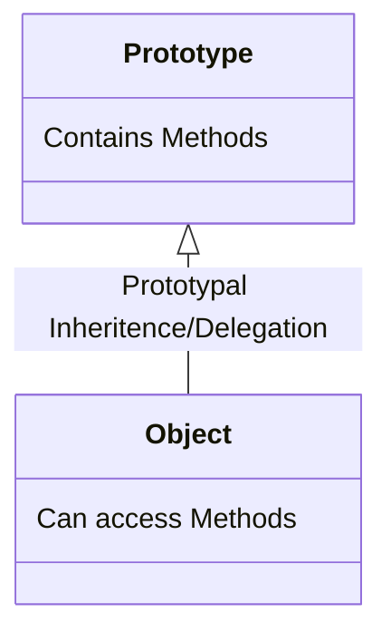

Classical OOP: Classes
- Objects (instances) are instantiated from a class, which functions like a blueprint.

### In JavaScript
- Objects are linked to a prototype object

- Prototypal inheritance - <mark style="background: #650BB3;">The prototype contains methods (behavior) that are accessible to all objects linked to that prototype</mark>.
- Behavior is delegated to the linked prototype object.

#### 3 Ways of Implementing Prototypal Inheritance in JavaScript
1. Constructor functions 
	- Technique to create objects from a function.
	- This is how built-in objects like Arrays, Maps or Sets are actually implemented.
2. ES6 Classes
	- Modern alternative to constructor function syntax.
	- "Syntatic sugar": behind the scenes, ES6 classes work exactly like constructor functions.
	- ES6 classes do NOT behave like classes in classical OOP.
3. Object.create()
	- The easiest and most straightforward way of linking an object to a prototype object.