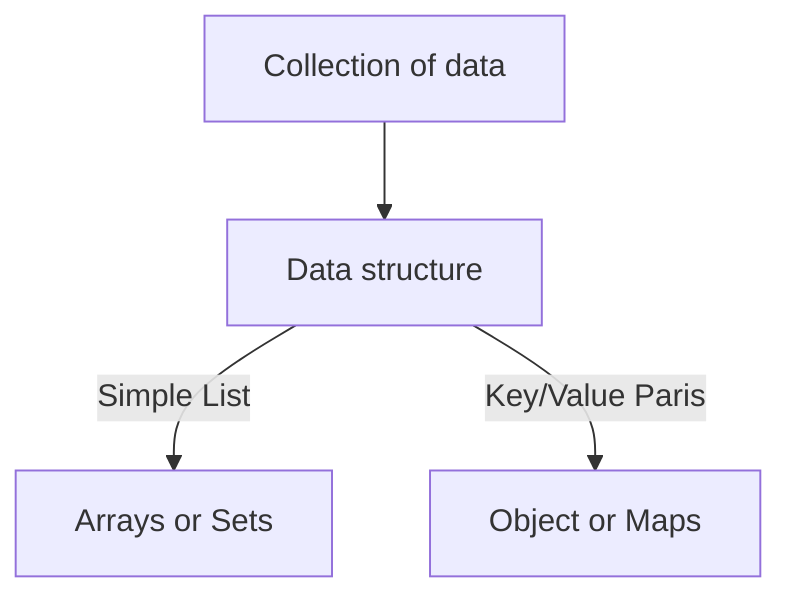

Sources of data
1. From the program itself: Data written directly in the source code. (status messages)
2. From the UI: Data input from the user or data written in DOM (ex. tasks in todo app)
3. From external sources: Data fetched for example from web API

Arrays vs. Sets
- Arrays
	- Use when you need <mark style="background: #650BB3;">ordered</mark> list of values(might contain duplicates)
	- Use when you need to <mark style="background: #650BB3;">manipulate</mark> data
- Sets
	- Use when you need to work with <mark style="background: #650BB3;">unique</mark> values
	- Use when <mark style="background: #650BB3;">high-performance</mark> is really important
	- Use to <mark style="background: #650BB3;">remove duplicates</mark> from arrays

Objects vs. Maps
- Objects
	- More "traditional" key/value store ("abused" objects)
	- Easier to write and access values with . and []
	- Use when you need to include <mark style="background: #650BB3;">functions</mark> (methods)
	- Use when working with JSON (can convert to map)
- Maps
	- Better performance
	- Keys can have any data type 
	- Easy to iterate
	- Easy to compute size
	- Use when you simply need to map key to values
	- Use when you need keys that are not strings 